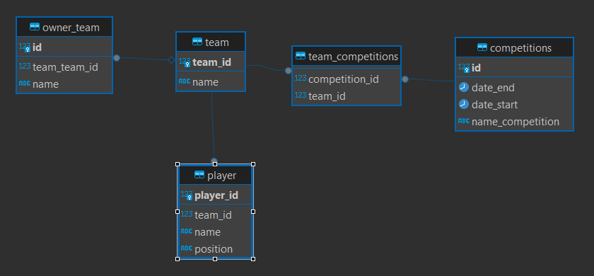

## Learn Spring Data JPA

This repository is only to study how to create associations between entities, and this repository
will work like a notebook en may in the future will back to see my notes.

This project works with:
    docker compose using a postgres db
    

The next Diagram will be our implementations (Level Basic)

